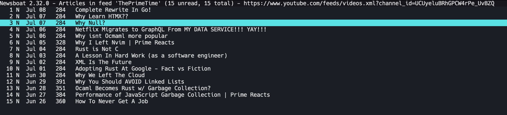

# Simple web server to watch youtube videos without recommendations

Example route -
http://127.0.0.1:5005/?url=https://www.youtube.com/watch?v=AOzy44b2gko

Original video - https://www.youtube.com/watch?v=AOzy44b2gko


Can be used with neswboat RSS reader as a youtube video player by using this macro:

For Mac OS users:
```
macro o set browser "open http://127.0.0.1:5005?url=%u"; open-in-browser ; set browser "open %u"
```

For Linux users:
```
macro o set browser "firefox http://127.0.0.1:5005?url=%u"; open-in-browser ; set browser "firefox %u"
```

Press `, + o` to open the video in the browser.



## Installation

```
mkvenv
pip install -r requirements.txt
```

## Local Run

```
python wsgi.py
```
---

If you are a Linux user you can create systemd service to run the server on a startup.

If you are Mac OS use launchd instead.
